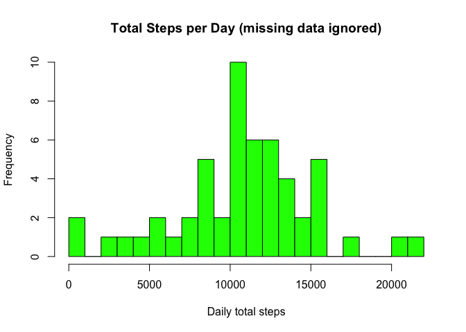
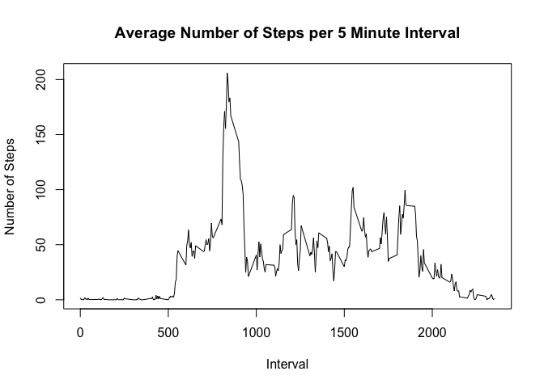
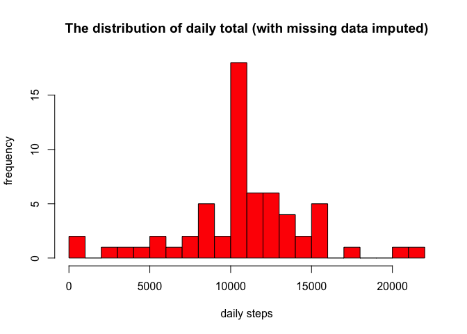
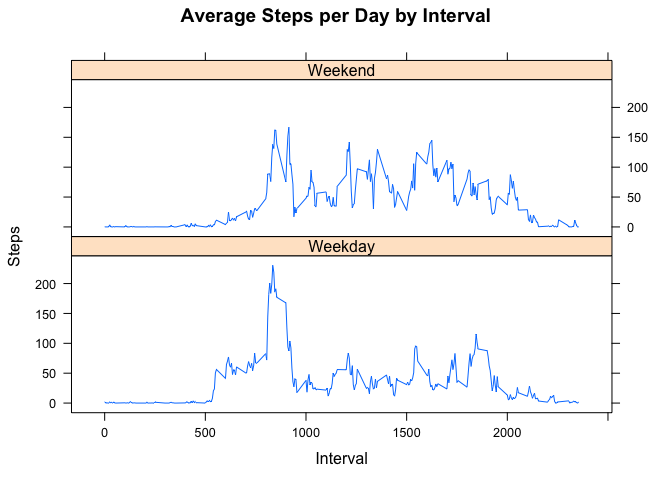

# Reproducible Research: Peer Assessment 1


This is a report that answers the questions in the assignment 1. The entire assignment is made in a single R markdown document processed by knitr and transformed into an HTML file.

#### Reading  the dataset and/or processing the data

1. Loading the data


```r
act_data <- read.csv("activity.csv", header = TRUE, sep = ',', colClasses = c("numeric", "character","integer"), na.strings = "NA")
head(act_data)
```

```
##   steps       date interval
## 1    NA 2012-10-01        0
## 2    NA 2012-10-01        5
## 3    NA 2012-10-01       10
## 4    NA 2012-10-01       15
## 5    NA 2012-10-01       20
## 6    NA 2012-10-01       25
```

2. Processing the data into a format suitable for analysis


```r
act_data$date<- as.Date(act_data$date)
```

#### What is mean total number of steps taken per day?

For this part of the assignment, missing values in the dataset are ignored.

1. The total number of steps taken per day is calculated


```r
steps_by_day <- aggregate(steps ~ date, act_data, sum)
```

2. A histogram of the total number of steps taken each day is made; the 20 buckets is arbitrarily chosen.  


```r
hist(x=steps_by_day$steps,
     col="green",
     breaks =20,
     xlab="Daily total steps",
     ylab="Frequency",
     main="Total Steps per Day (missing data ignored)")
```

<!-- -->

3. Calculate and report the mean and median of the total number of steps taken per day


```r
steps_mean <- mean(steps_by_day$steps, na.rm=TRUE)
steps_median <- median(steps_by_day$steps, na.rm=TRUE)
print(paste("The mean steps per day is: ", steps_mean))
```

```
## [1] "The mean steps per day is:  10766.1886792453"
```

```r
print(paste("The median steps per day is: ", steps_median))
```

```
## [1] "The median steps per day is:  10765"
```

#### What is the average daily activity pattern?
1. Calculate average steps for each interval for all days.
2. Plot the Average Number Steps per Day by Interval.
3. Find interval with most average steps.


```r
steps_by_interval <- aggregate(steps ~ interval, act_data, mean, na.rm=TRUE)
plot(steps_by_interval$interval,steps_by_interval$steps, type="l", xlab="Interval", ylab="Number of Steps",main="Average Number of Steps per 5 Minute Interval")
```

<!-- -->

Next is to check which 5-minute interval, on average across all the days in the dataset, contains the maximum number of steps:


```r
max_steps <- max(steps_by_interval$steps)
print(paste("The maximum number of steps in a five minute interval was: ", max_steps))
```

```
## [1] "The maximum number of steps in a five minute interval was:  206.169811320755"
```

#### Imputing missing values
Note that there are a number of days/intervals where there are missing values (coded as 𝙽𝙰). The presence of missing days may introduce bias into some calculations or summaries of the data.

1. Calculate and report the total number of missing values in the dataset


```r
sum(is.na(act_data$steps))
```

```
## [1] 2304
```

2. Imputing missing values using mean for each day; 3. Create a new dataset that is equal to the original dataset but with the missing data filled in


```r
act_data2<- act_data
NAs<- is.na(act_data2$steps)
avg_interval<- tapply(act_data2$steps, act_data2$interval, mean, na.rm=TRUE, simplify = TRUE)
act_data2$steps[NAs] <- avg_interval[as.character(act_data2$interval[NAs])]
names(act_data2)
```

```
## [1] "steps"    "date"     "interval"
```
Check that there are no missing values 


```r
sum(is.na(act_data2$steps))
```

```
## [1] 0
```
No more missing values

Now reorder columns for better understanding the data

```r
act_data2<- act_data2[, c("date", "interval", "steps")]
head(act_data2)
```

```
##         date interval     steps
## 1 2012-10-01        0 1.7169811
## 2 2012-10-01        5 0.3396226
## 3 2012-10-01       10 0.1320755
## 4 2012-10-01       15 0.1509434
## 5 2012-10-01       20 0.0754717
## 6 2012-10-01       25 2.0943396
```

4. Make a histogram of the total number of steps taken each day and Calculate and report
the mean and median total number of steps taken per day. 


```r
new_dailysum <- tapply(act_data2$steps, act_data2$date, sum, na.rm=TRUE, simplify=T)

hist(x=new_dailysum,
     col="red",
     breaks=20,
     xlab="daily steps",
     ylab="frequency",
     main="The distribution of daily total (with missing data imputed)")
```

<!-- -->

```r
mean(new_dailysum)
```

```
## [1] 10766.19
```

```r
median(new_dailysum)
```

```
## [1] 10766.19
```

Based on the imputed data set, the new mean is 10766 and the new median is 10766 . Compare with the original mean 10766 and median 10765 , the mean doesn't change, and the median has a small change. In fact, the new median becomes identical to the mean. One possible explanation is that when we fill the missing data for the intervals, we use means for intervals, so we have more data close or identical to the means, and median is shifted and becomes identical to the mean.

The impact of imputing missing data on the estimates of the total daily number of steps is also clear: now we have higher frquency counts in the histogram at the center region (close to the mean).

#### Are there differences in activity patterns between weekdays and weekends?

1. Using the new NA filled in, create a new factor variable in the dataset with two levels–“weekday”and“weekend” indicating whether a given date is a weekday or weekend day.


```r
weekdays <- c("Monday", "Tuesday", "Wednesday", "Thursday", "Friday")
act_data2$dow = as.factor(ifelse(is.element(weekdays(as.Date(act_data2$date)),weekdays), "Weekday", "Weekend"))

steps_by_interval_i <- aggregate(steps ~ interval + dow, act_data2, mean)
```
2. Make a panel plot containing a time series plot of the 5-minute interval (x-axis) and the average number of steps taken, averaged across all weekday days or weekend days (y-axis). 

```r
library(lattice)
xyplot(steps_by_interval_i$steps ~ steps_by_interval_i$interval|steps_by_interval_i$dow, main="Average Steps per Day by Interval",xlab="Interval", ylab="Steps",layout=c(1,2), type="l")
```

<!-- -->
